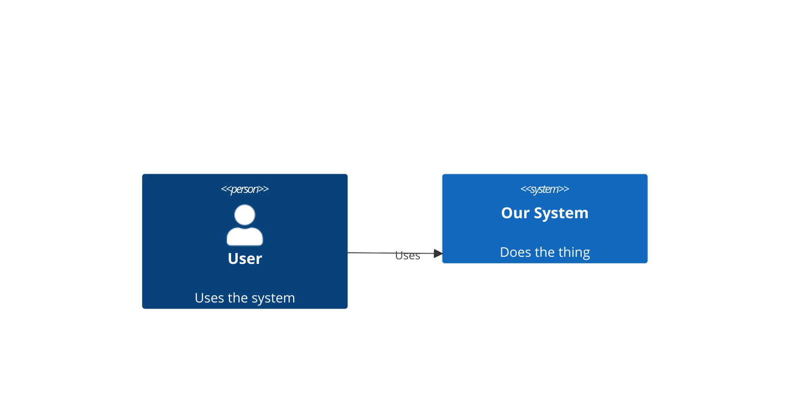

---
metadata:
  type: reference
  invocation: both
  practice: null
name: diagrams
description: "Create architecture diagrams, flowcharts, sequence diagrams, and system visualizations. Covers ASCII, Mermaid, C4, D2, and HTML visual reports. Use when asked to diagram, visualize, draw, illustrate, map out, or show how components connect. Trigger: diagram, flowchart, architecture diagram, sequence diagram, C4, mermaid, ascii art, visualize, draw, system map, data flow, show the architecture, explain visually."
---

# Diagrams Skill

## Decision Flow

1. **C4 zoom level** — which abstraction?
   - L1 Context: who uses it, what it talks to
   - L2 Container: what runs (apps, DBs, queues)
   - L3 Component: what's inside a container
   - L4 Code: rarely needed — IDE handles this

2. **Format** — ask user, or default to ASCII:

| Situation | Format | Why |
|-----------|--------|-----|
| Inline in docs | ASCII | No tooling, survives copy-paste |
| GitHub/GitLab rendered | Mermaid | Native rendering |
| Architecture with containers | D2 | Auto-layout, container edges |
| Formal design doc | C4 PlantUML | Full methodology via Kroki |

## ASCII (default)

Rules:
- Box-drawing chars: `┌ ┐ └ ┘ │ ─ ┬ ▶ ▼`
- Label every box and arrow
- Max width 80 chars
- Single flow direction (TD or LR, never both)

## Mermaid

Use for: sequence diagrams, flowcharts with branches, state machines.

C4 in Mermaid:


### Mermaid Limits

| Type | Comfortable | Max | Then use |
|------|:-----------:|:---:|----------|
| Flowchart | 15–25 | ~70 | D2 or Graphviz |
| Class | 10–15 | ~40 | Split diagrams |
| Sequence | 5–8 participants | ~15 | Split scenarios |

Workarounds: `subgraph` clustering, split into linked diagrams.

## D2 (architecture diagrams)

```d2
direction: right
user: User {shape: person}
system: Our System {
  api: API
  db: Database {shape: cylinder}
}
user -> system.api: Uses
system.api -> system.db: Reads/Writes
```

Render: `POST https://kroki.io/d2/svg`

## C4 Checklist

Every architecture diagram must answer:
- [ ] What zoom level? (Context / Container / Component)
- [ ] Who are the actors?
- [ ] What are the boundaries?
- [ ] What are the relationships? (labeled with protocol)
- [ ] Is there a legend?

## HTML Report Delivery (Visual Reports)

For multi-diagram output (architecture reviews, comparison reports), generate a self-contained HTML file:

1. Write to OS temp dir: `$TMPDIR/architecture-review-<timestamp>.html` (or `/tmp` fallback)
2. Include via CDN: Tailwind (styling) + Mermaid (diagrams)
3. Open for user: `xdg-open` (Linux), `open` (macOS), `start` (Windows)
4. Tell user the absolute path

**When to use HTML delivery:**
- Architecture review with multiple candidates (before/after diagrams)
- Comparison reports (options side-by-side)
- Any output with >2 diagrams that would clutter a markdown file

**Structure:** Cards per topic, each with diagram + prose. Mix Mermaid (graph-shaped relationships) with hand-crafted CSS/SVG (editorial visuals, mass diagrams). End with a "Top recommendation" section.

Nothing lands in the repo — temp dir only.
