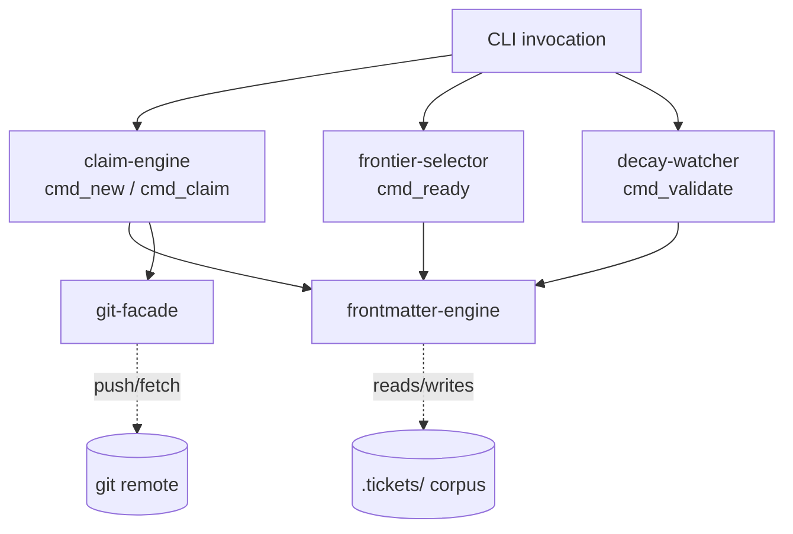
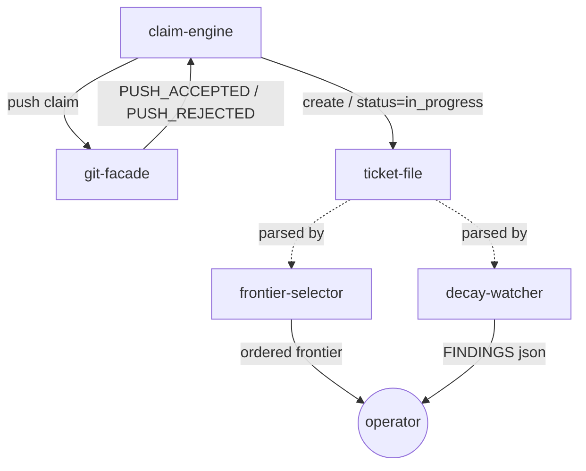
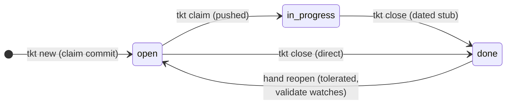
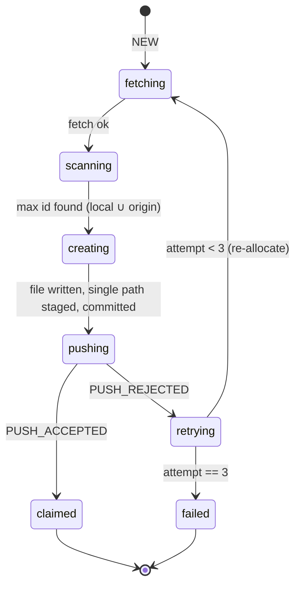

# tkt Domain Model

Human-readable projection of `tkt-actors.yaml` (archwright-model, 2026-07-20). All actors
are **(planned)** — ticket 40 builds them; specs derived from this model are acceptance
criteria, and their checks are PENDING until `tools/tkt/` exists (except the two marked
active, which run against the existing `.tickets/` corpus today).

## Composition

Flat by nature — tkt is a CLI, not a daemon. Each command is a short-lived process that
constructs the boundary services, operates on the durable corpus, and exits. The only
durable state is ticket files plus the git remote.



## Event Flow



## State Machines

### ticket-file (the domain FSM)



| Transition | Guard / effect | Pattern |
|---|---|---|
| new → open | id allocated via claim loop; file + commit + push atomic-by-command | git-native-claim |
| open → in_progress | commit+push so WIP is visible to other sessions | git-native-claim |
| * → done | dated Resolution stub appended; unchecked ACs warned | automate-or-drop |
| hand edits | any field, any time — contract tolerance; validate reports drift | preserve-or-fail |

### claim-engine (allocation loop)



| Invariant | Source |
|---|---|
| fetch precedes every scan; scan covers local AND origin | git-native-claim |
| staged pathspec is exactly one file | surgical-git-side-effects (D2a) |
| ≤ 3 attempts; every retry re-fetches | resolve D1a |
| never force-push | git-native-claim |

## Key Sequence: Concurrent Allocation Race

```mermaid
sequenceDiagram
    participant A as session A
    participant R as remote
    participant B as session B
    A->>R: fetch; scan max=41; create 42; push
    B->>R: fetch; scan max=41; create 42; push
    R-->>A: accepted (42 = A's)
    R-->>B: REJECTED (non-fast-forward)
    B->>R: re-fetch; scan max=42; renumber to 43; push
    R-->>B: accepted (43 = B's)
    Note over B: reports "renumbered 42→43"
```

## Boundary Decision Table

| Entity | Classification | Heuristic |
|---|---|---|
| ticket-file | Actor (durable) | Single-writer per field (automate-or-drop ownership); independent lifecycle; the domain language lives here |
| claim-engine | Actor (transient) | Owns allocation attempt state; communicates with git via events (push outcomes) |
| decay-watcher | Actor (transient) | Enforcement actor: trigger → check → report (constraint patterns need enforcers) |
| frontier-selector | Boundary service | Stateless computation; no owned state, no FSM — trigger/compute/report |
| frontmatter-engine | Boundary service | Facade over files; no domain events (preserve-or-fail lives here as discipline, not state) |
| git-facade | Boundary service | Facade over subprocess git; outcomes surface as claim-engine events |
| .tickets/ corpus | Configuration authority | Immutable-per-run reference; padding inference source |

## Key Invariants (input to derive)

1. **Status vocabulary and transitions** (ticket-file): status ∈ {open, in_progress, done}; tool transitions only forward; hand-reopen tolerated and watched. [intersection-contract, git-native-claim]
2. **Claim atomicity** (claim-engine): no locally-minted id without its push accepted; rejected push → re-allocation, bounded at 3. [git-native-claim, D1a]
3. **Selection pipeline order** (frontier-selector): eligibility (open + deps done + env match) strictly precedes urgency, which strictly precedes numeric order; in_progress is never frontier. [layered-selection]
4. **Preservation** (frontmatter-engine): unknown fields byte-identical across any rewrite; no YAML dumper on the write path. [preserve-or-fail]
5. **Loud failure** (frontmatter-engine): unparseable file ⇒ named error, every command, nonzero exit. [preserve-or-fail]
6. **Staging discipline** (git-facade): every tool commit stages exactly one explicit path. [surgical-git-side-effects, D2a]
7. **Decay findings** (decay-watcher): dangling/cyclic blocked_by, id/filename mismatch, unchecked-ACs-on-done, non-contract status — all reported as structured findings. [automate-or-drop]

Diagrams are Mermaid source, unrendered (merman-cli not installed on this machine) — they render on GitHub/Code Browser.
